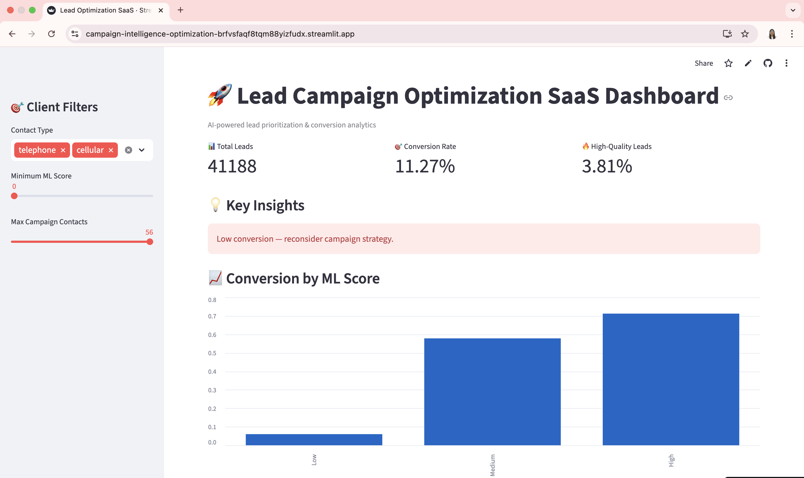

# AI Lead Scoring & Campaign Optimization Platform

🔗 **Live Demo:** https://campaign-intelligence-optimization-brfvsfaqf8tqm88yizfudx.streamlit.app/  

📊 AI-powered lead scoring & campaign optimization platform

---

## 📸 Dashboard Preview

---

## 📌 Overview

This project is an **AI-powered lead scoring and campaign optimization platform** designed to identify high-conversion prospects and improve marketing efficiency.

By combining **machine learning, SQL filtering, and interactive analytics**, the system transforms raw campaign data into actionable insights and prioritized lead lists.

Using a dataset of **41,188 telemarketing records**, the platform demonstrates how intelligent targeting can significantly outperform traditional mass outreach strategies.

🚀 **Key outcome:** Increased conversion efficiency by **473%** through data-driven lead prioritization.

---

## 🎯 Key Results

🚀 The system significantly improves campaign performance through intelligent lead prioritization:

| Metric | Baseline | Optimized |
|--------|----------|-----------|
| Conversion Rate | 11.27% | **64.60%** |
| Efficiency Improvement | — | **+473%** |
| Model Accuracy | — | **~91%** |
| Model Precision | — | **~66%** |
| Precision (High-Score Leads) | — | **~75%** |
| Lead Reduction | — | **96.67%** |

💡 **Key Insight:** A small subset of high-quality leads drives the majority of conversions, enabling more efficient allocation of marketing resources.

---

## 🧠 How the System Works

The platform follows a structured pipeline that transforms raw campaign data into actionable lead intelligence:

### 1. 🧹 Data Cleaning & Preparation
- Handle missing and `"unknown"` values  
- Remove non-actionable records (e.g., `duration = 0`)  
- Standardize categorical variables  
- Validate numerical features (`campaign`, `pdays`, `previous`)  

✅ Ensures data quality and reliable downstream analysis

---

### 2. 🤖 Machine Learning Model
- Logistic Regression predicts conversion probability  
- One-hot encoding for categorical features  
- Feature scaling for numerical stability  

**Performance:**
- Accuracy: ~91%  
- Precision: ~66%  
- Recall: ~40%  

---

### 3. 🎯 ML-Based Lead Scoring
Each lead is assigned a score based on predicted conversion probability:

**ML Score = Probability of Conversion (0–100)**

---

### 4. 📊 Interactive Dashboard
A Streamlit-based SaaS dashboard enables:

- Real-time lead filtering  
- Conversion analytics  
- Campaign performance insights  
- Export of high-quality leads  
- Scenario-based prediction  

---

### 5. 🗄 Data Storage & Processing
- SQLite database stores processed datasets  
- SQL queries used for segmentation and filtering  
- Efficient pipeline for reproducible analytics

---

## 💡 Business Impact

This system demonstrates how data-driven lead prioritization can transform marketing performance:

- 🎯 **Higher Conversion Efficiency** — Focuses on high-intent leads instead of mass outreach  
- 💰 **Cost Reduction** — Minimizes wasted effort on low-probability prospects  
- ⚡ **Improved Resource Allocation** — Enables smarter campaign targeting and follow-ups  
- 📈 **Scalable Decision-Making** — Supports consistent, data-driven strategies across campaigns  

🚀 By prioritizing quality over quantity, the system shifts marketing from brute-force outreach to intelligent targeting.

---

📊 Demonstrates a clear trade-off: reducing lead volume by ~96% while significantly increasing conversion rates.

---

## 🛠 Tech Stack

- **Python** — Core programming language  
- **Pandas / NumPy** — Data processing and analysis  
- **Scikit-learn** — Machine learning modeling  
- **SQLAlchemy** — Database interaction  
- **SQLite / PostgreSQL** — Data storage and querying  
- **Streamlit** — Interactive dashboard (SaaS interface)

---

## 🌐 Deployment

Deployed using Streamlit Community Cloud.

👉 Live App: https://campaign-intelligence-optimization-brfvsfaqf8tqm88yizfudx.streamlit.app/
